# AgentOps Harness

**Flagship portfolio project for agent harness engineering, coding-agent orchestration, safety, evaluation, and developer-productivity AI.**

AgentOps Harness is a local-first framework for safely orchestrating AI coding agents on real repositories. It enforces a structured workflow — repo analysis, planning, implementation support, testing, review, risk scoring, and PR reporting — so AI-assisted development becomes traceable, measurable, and safer for engineering teams.

AI coding agents can generate code. Engineering teams still need the surrounding control plane: structured plans, repeatable validation, review findings, risk gates, run history, and PR-ready reports. That is the layer this project demonstrates.

## Demo

> _Walkthrough video and screenshots: TBD — to be added before public release._

```bash
agentops workload run examples/workloads/request-logging-fastapi.yaml
# scan -> plan -> execute -> validate
# risk: low | evidence: captured | report: guarded
```

## Stack

Python · LangGraph · Typer (CLI) · FastAPI (HTTP API) · SQLite + JSONL (run storage) · Pydantic · pytest · MCP stdio server · Anthropic Claude (recommended provider) · OpenRouter (compatible client) · mock provider by default — no paid API key required to run the demo.

| Metric | Baseline | AgentOps Harness MVP |
|---|---:|---:|
| Run trace visibility | Ad hoc chat | Structured run record |
| Safety checks | Manual review | Deterministic risk score |
| Demo API keys required | Often yes | No, mock mode by default |
| Run history | Terminal scrollback | SQLite/JSONL storage |

```bash
uv sync --extra dev
uv run --extra dev agentops scan --repo examples/sample_fastapi_app
uv run --extra dev agentops run --repo examples/sample_fastapi_app --task "Add request logging middleware"
```

## Architecture

```mermaid
flowchart LR
  T[Task + Repo] --> S[Repo Scanner]
  S --> M[Experience Recall]
  M --> P[Planner]
  P --> W[Optional External Worker]
  W --> D[Diff Collector]
  D --> R[Test Runner]
  R --> V[Reviewer]
  V --> RG[Risk Guard]
  RG --> PG[Permission Gate]
  PG --> PR[PR Writer]
  PR --> QG[Report Quality Guard]
  QG --> EG[Evidence Guard]
  EG --> VS[Verification Stack]
  VS --> CA[Conflict Auditor]
  CA --> H[Run History]
```



The pipeline is implemented as a LangGraph state machine:

```text
scan_repo -> recall_experience -> create_plan -> optional_external_worker ->
collect_diff -> run_tests -> review_diff -> assess_risk -> classify_permissions ->
write_report -> check_report_quality -> check_evidence -> assemble_verification ->
audit_conflicts
```

## Observe Mode And Edit Mode

`agentops run` is observe-only: it plans, reads the current diff, runs validation, reviews risk, and writes a report.

`agentops edit` runs one explicit external worker command first, then validates the resulting diff:

```bash
uv run --extra dev agentops edit \
  --repo /path/to/repo \
  --task "Add request logging middleware" \
  --worker-command 'cursor-agent --repo {repo_path} --task {task}'
```

The harness does not pick a hidden worker or make a paid model call by default. The target repo must be clean unless `--allow-dirty` is provided, so changed files can be attributed to the worker.

### Worker packets and workloads

Deterministic packets for Cursor/Codex/external CLIs reduce repeated planning chatter:

```bash
uv run --extra dev agentops handoff draft \
  --repo examples/sample_fastapi_app \
  --task "Describe the logging middleware work for a worker agent"

uv run --extra dev agentops handoff export \
  --run-id <persisted-run-id>

uv run --extra dev agentops handoff export --run-id <id> --json
```

Workload manifests declare portfolio repos plus optional gates (`max_risk_score`, exact `required_commands`):

```bash
uv run --extra dev agentops workload validate examples/workloads/request-logging-fastapi.yaml
uv run --extra dev agentops workload check \
  --manifest examples/workloads/request-logging-fastapi.yaml \
  --run-id <persisted-run-id>
```

```python
from pathlib import Path

from app.core.graph import run_harness

record = run_harness(
    repo_path=Path("examples/sample_fastapi_app"),
    task="Add request logging middleware",
    storage_path=Path(".agentops/runs.jsonl"),
)
print(record.risk_report.risk_score)
```

## Evaluation

Reproduce the current validation suite:

```bash
uv run pytest -q
uv run ruff check .
```

## API

```bash
uv run --extra dev uvicorn app.api:api --reload
```

```bash
curl -X POST http://127.0.0.1:8000/runs \
  -H "Content-Type: application/json" \
  -d '{"repo_path":"examples/sample_fastapi_app","task":"Add request logging middleware"}'
```

To use edit mode through the API, include `worker_command` in the request body.

Useful endpoints:

- `POST /runs`
- `GET /runs`
- `GET /runs/{run_id}`
- `GET /runs/{run_id}/report`
- `GET /runs/{run_id}/logs`
- `GET /runs/{run_id}/handoff?format=markdown|json`

## Cursor And Goose

Install Cursor commands/rules into a repository:

```bash
uv run --extra dev agentops integrations cursor --repo .
```

Generate a Goose recipe:

```bash
uv run --extra dev agentops integrations goose --repo .
```

See [docs/CURSOR_GOOSE_INTEGRATION.md](docs/CURSOR_GOOSE_INTEGRATION.md).

## MCP Server

Run AgentOps Harness as an MCP stdio server:

```bash
uv run --extra dev agentops-mcp
```

Exposed tools:

- `agentops_scan`
- `agentops_run`
- `agentops_get_report`
- `agentops_list_runs`

See [docs/MCP_SERVER.md](docs/MCP_SERVER.md).

## Evidence Guard

AgentOps Harness checks generated PR reports against actual run evidence. If a model claims files or tests were added without git evidence, the final report gets an `Evidence Guard` section with unsupported claims.

This is the core harness-engine idea: AI output is not trusted until it is grounded against repo state, test output, risk signals, and execution traces.

## Report Quality Guard

If a provider returns malformed output, AgentOps Harness falls back to a deterministic local PR report and appends a `Report Quality Guard` section explaining why. The run stays usable even when the model output is not.

Provider failures are also isolated. If OpenRouter/OpenAI returns malformed structured output during planning or review, the graph records a provider fallback event and continues with deterministic local behavior.

## Research Grounding: "Code as Agent Harness"

The harness implements concepts from the *Code as Agent Harness* paper, mapping
its four properties (Executable, Inspectable, Stateful, Governed) onto concrete,
tested components. Each is deterministic and runs in mock mode — no API key needed.

| Paper concept | Component | What it does |
|---|---|---|
| §5.2.2 Verification stack | `app/agents/verification_stack.py` | Assembles a layered verification bundle (tests, review, risk, evidence) with explicit scope, appended to every report. |
| §5.2.5 Multi-tier permissions | `app/agents/permission_gate.py` | Classifies each change/command into `auto`/`ask`/`deny` tiers; secret edits and destructive commands are denied, dependency and sensitive-folder changes need approval. |
| §4.3.2 Convergence benchmark | `app/core/benchmark.py` | Types each run by which of the six convergence kinds it reached, and flags **implicit convergence** — completing without verifying — the paper's "most significant gap." |
| §3.2.3 Experiential memory | `app/core/memory.py` | Before planning, recalls the most lexically similar past runs and feeds their lessons (implicit gaps, prior blocks, failing tests) into the new plan. |
| §5.2.3 Conflict policy | `app/core/conflict.py` | Audits the plan, tests, report, evidence, and gates for contradictions (e.g. a report claiming tests pass while they failed) before shipping. |
| §3.5 Evolution Agent | `app/core/evolution.py` | Reads aggregate run history and proposes structural harness improvements, each citing the run IDs that justify it. |

Run the convergence-typed benchmark and the Evolution Agent:

```bash
uv run --extra dev python scripts/benchmark.py
uv run --extra dev python scripts/evolve.py .agentops/runs.jsonl
```

## Local Mac App Direction

A local-only macOS app should be a SwiftUI shell over the Python harness engine, not a rewrite.

The MVP uses deterministic mock agents so the full demo runs without paid API keys.

## LLM Providers

`mock` is the default provider. OpenRouter and direct OpenAI are optional and use the same OpenAI-compatible client abstraction.

```bash
AGENTOPS_LLM_PROVIDER=openrouter
AGENTOPS_OPENROUTER_API_KEY=...
AGENTOPS_OPENROUTER_MODEL=deepseek/deepseek-v4-flash
```

Check provider readiness without making a network call:

```bash
uv run --extra dev agentops providers status
```

Make a real provider call after exporting credentials:

```bash
uv run --extra dev agentops providers ping
```

```bash
AGENTOPS_LLM_PROVIDER=openai
AGENTOPS_OPENAI_API_KEY=...
AGENTOPS_OPENAI_MODEL=gpt-4o-mini
```

No real `.env` file is required for the demo. Use `.env.example` as the reference only.

## Portfolio Positioning

This is intended to be the main GitHub showcase repo for an **Agent Harness Specialist** profile. The other portfolio projects can become workloads evaluated by this harness: ContextForge for context engineering, AgentOrchestra for multi-agent systems, EvalEngine for evals, MCPGuard for safety, and Second Brain OS for research/knowledge workflows.

The control-plane strategy: AgentOps Harness plans, delegates to external coding workers, validates the result, and packages portfolio evidence.
