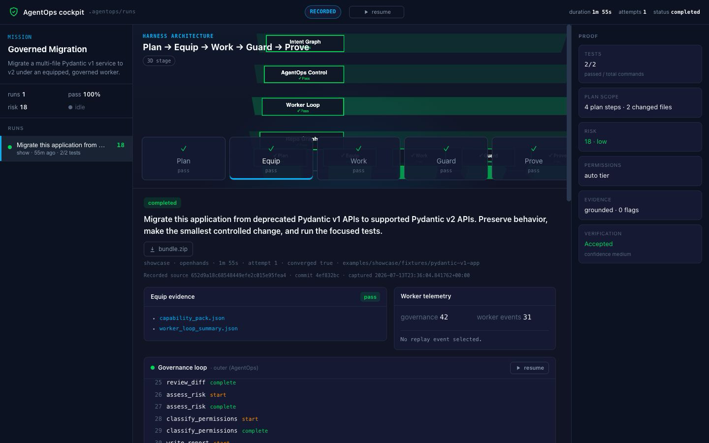
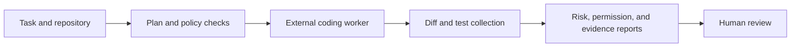

# AgentOps Harness

> [!IMPORTANT]
> AgentOps Harness is a small experimental project. It contains working and
> tested ideas, but it is not production-ready and still needs substantial
> design, validation, and simplification.

AgentOps Harness explores one question: **can a separate control layer make a
coding agent's work easier to inspect, constrain, and verify?**

The project wraps an external coding worker with planning, permission checks,
validation, and evidence collection. It does not replace the worker's own edit
loop. The worker changes code; AgentOps records what was requested, checks what
happened, and packages the result for human review.



## Project status

This repository is the result of roughly three months of exploration. The
prototype grew across orchestration, governance, evaluation, worker adapters,
and a visual run viewer. That breadth produced useful experiments, but it also
made the project harder to explain and finish.

The current goal is smaller: keep AgentOps as an honest testbed for governed
coding-agent runs, consolidate the parts that work, and avoid presenting the
roadmap as completed functionality.

### Implemented experiments

- Repository scanning and deterministic run records
- Plan, risk, permission, test, review, and evidence artifacts
- Observe-only analysis of an existing working-tree diff
- External worker adapters for CLI tools and the OpenHands SDK
- Local and container-based workspace experiments
- A bounded retry and validation pipeline
- A recorded migration run that can be replayed in the Cockpit UI
- Python and browser-side test suites

These components are implemented and tested to different depths. Their
presence does not yet establish production reliability or prove that the
harness improves a coding agent's success rate.

### Current limitations

- The project has not been validated with a sustained, real-world workload.
- Worker, workspace, and provider paths do not all have equal end-to-end
  coverage.
- Security and isolation behavior has not received an independent audit.
- Some terminology, schemas, documentation, and CLI behavior still need to be
  consolidated.
- The visual Cockpit is primarily a run inspector and recorded showcase, not a
  complete operations console.
- Live worker runs may require third-party CLIs, credentials, Docker, or paid
  model access.
- The larger roadmap in this repository is exploratory. It should not be read
  as a promise or as evidence that those capabilities exist.

Always review generated changes and evidence yourself before accepting them.

## Try the recorded showcase

The most complete way to understand the project is the recorded migration
showcase. It uses committed artifacts and does not require an API key.

```bash
git clone https://github.com/Ven-Z8/agentops-harness.git
cd agentops-harness
uv sync --extra dev
make showcase
```

The showcase loads a recorded Pydantic migration into the local FastAPI-backed
Cockpit. It presents the task plan, worker activity, governance results, tests,
and final evidence. The recording is a demonstration fixture, not a live agent
run.

## Run the core commands

Requirements:

- Python 3.12 or newer
- [`uv`](https://docs.astral.sh/uv/)
- Node.js for the browser-side tests
- Docker only for container workspace experiments

Scan the included example repository:

```bash
uv run --extra dev agentops scan --repo examples/sample_fastapi_app
```

Create an observe-only run with the default mock provider:

```bash
uv run --extra dev agentops run \
  --repo examples/sample_fastapi_app \
  --task "Review the current changes"
```

`agentops run` does not launch a coding worker or edit the repository. It
inspects available state and produces local run artifacts. Worker-driven edit
flows are experimental; inspect the available options before using them:

```bash
uv run --extra dev agentops edit --help
```

Run the verification suites:

```bash
make test
make lint
make frontend-test
```

## How it fits together



AgentOps owns the outer record-and-review pipeline. An external tool such as
Codex, Claude Code, OpenCode, or OpenHands owns the iterative code-editing loop.
Keeping that boundary explicit is the main architectural idea explored here.

## Repository guide

| Path | Purpose |
| --- | --- |
| `app/` | CLI, API, schemas, worker adapters, and pipeline code |
| `tests/` | Python unit and integration tests |
| `web/` | Cockpit UI and browser-side tests |
| `examples/showcase/` | Recorded migration run and its evidence artifacts |
| `examples/sample_fastapi_app/` | Small repository used by local examples |
| `packs/` | Experimental capability-pack definitions |
| `docs/` | Architecture notes and earlier design explorations |
| `coordination/` | Project-control records and the broader experimental roadmap |

For the current product boundary, see
[`coordination/PROJECT.md`](coordination/PROJECT.md). Historical design documents
are useful context, but they may describe ideas that were never completed.

## Possible future work

If development continues, the highest-value work is deliberately modest:

1. Define one small end-to-end workflow and make it reproducible.
2. Reduce overlapping schemas, concepts, and documentation.
3. Harden terminal-state, permission, and workspace guarantees.
4. Test multiple workers against the same tasks and evidence criteria.
5. Measure whether the control layer improves outcomes enough to justify its
   complexity.

More speculative directions should wait until those foundations are credible.

## What this project demonstrates

AgentOps is not a finished agent platform. It is a working exploration of:

- separating a coding worker from the system that governs it;
- treating plans and run evidence as inspectable artifacts;
- failing closed when required evidence is missing;
- making automated work reviewable instead of relying on a model's summary;
- learning where additional orchestration helps and where it only adds
  complexity.

The useful conclusion so far is that governance needs to be narrow,
evidence-based, and cheaper to understand than the work it governs. This
repository remains open for further experiments, but future work should deepen
that core rather than expand the surface area.

## License

Licensed under the terms in [`LICENSE`](LICENSE).
