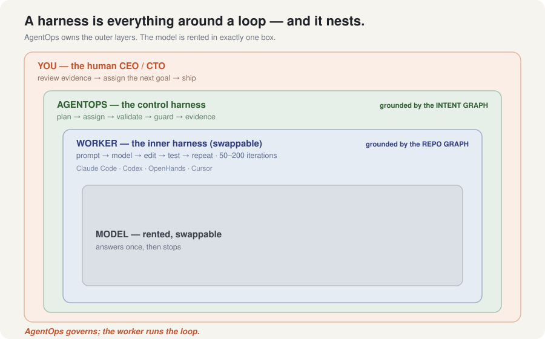
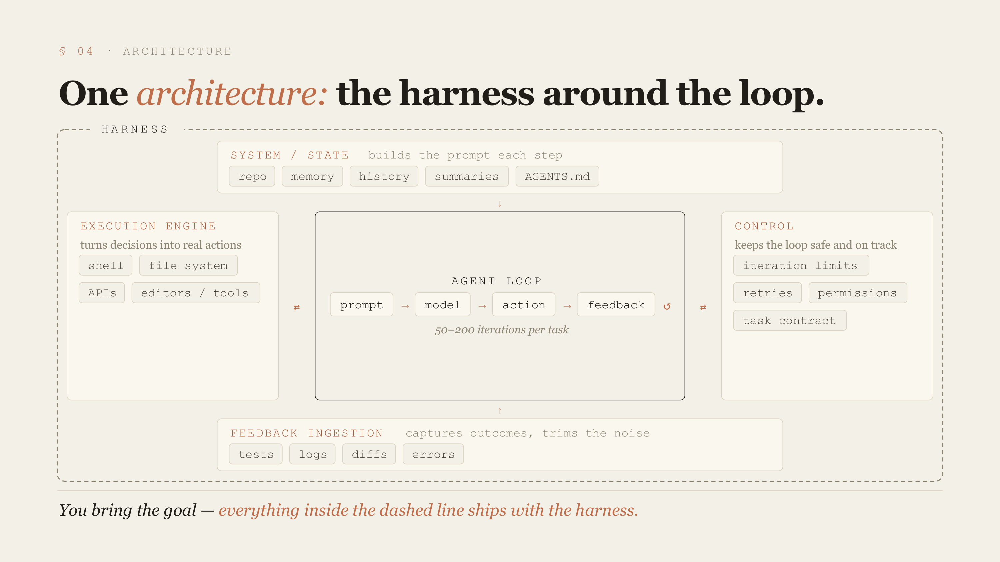

# AgentOps Harness

**A local-first control harness that wraps any coding agent with planning, validation, governance, and evidence — so a CEO/CTO can govern what gets built, not just generate code.**

A model answers once and stops. A *coding agent* (Claude Code, Codex, OpenHands) loops — read, edit, run, retry — until a task is done. **A harness is everything around that loop that makes it finish the task.** AgentOps Harness is the *outer* harness: it doesn't run the edit loop itself, it **governs** a swappable worker that does, and hands the human a graded, cited evidence trail.

## The idea: a harness nests

"Harness" isn't one thing — it's a relationship (*everything around a loop that makes it finish a task*), and it stacks. AgentOps owns the two outer layers; the model is rented in exactly one box.



Each layer starts *grounded* by a deterministic, locally-owned graph — and that grounding, not the model, is the moat:

| Layer | Grounded by | What it owns |
|---|---|---|
| **Worker** | **repo graph** (structure of the code) | the inner edit loop — swappable: Claude Code · Codex · OpenHands · Cursor |
| **AgentOps** | the pipeline below | *how* work is done — correctly, safely, with evidence |
| **CEO** | **intent graph** (structure of the purpose) | *what* is done and *whether it served the goal* |

> Full write-up: [docs/THREE_LAYER_FOUNDATION.md](docs/THREE_LAYER_FOUNDATION.md).

### What is a harness? (and what AgentOps does *not* do)

The inner box above is the **worker harness** — the well-understood anatomy every coding agent already ships: an agent loop wrapped by system/state, an execution engine, control, and feedback ingestion.



**AgentOps does not run the worker's tight inner loop** — it does not iterate a model 50–200 times, and it does not edit files. That is the worker's job, invoked inside one node (`run_external_worker`). AgentOps is the layer *above*: it hands the worker a grounded contract, then **governs** what comes back — including its *own* bounded outer loop (plan → worker → enforce → validate → retry). Concretely:

| Worker-harness part | Who owns it |
|---|---|
| The agent loop (prompt → model → edit → test, 50–200×) | **Worker** (Claude Code / Codex / OpenHands / OpenCode) |
| Execution engine (editing files, calling tools) | **Worker** |
| Feedback ingestion (tests, diffs, logs, errors) | **AgentOps** |
| Governance — enforce at dispatch (block / revert / sandbox), bounded retry loop | **AgentOps** |
| Control (permissions, plan-as-contract, timeouts) | **AgentOps** |
| System/state (repo graph, experiential memory, run history) | **AgentOps** (partial) |

That boundary *is* the product: AgentOps governs the loop instead of reimplementing it — it blocks denied edits, reverts what slips through, can run the worker fully sandboxed, and retries on failed validation.

## Quickstart (no API key — mock provider by default)

```bash
uv sync --extra dev
uv run --extra dev agentops scan --repo examples/sample_fastapi_app
uv run --extra dev agentops run  --repo examples/sample_fastapi_app --task "Add request logging middleware"
```

## CEO layer: intent graph + Product Reviewer

The CEO/CTO authors a deterministic **intent graph** — `agentops.goals.yaml` at the repo root — that states what the product *is*, what it is *not*, and the goals with discrete, checkable success signals:

```yaml
north_star: A local control harness that wraps any coding worker with governance.
not_this:
  - A hosted SaaS that stores your code off your machine.
goals:
  - id: G1
    statement: Ground every worker run in deterministic repo + intent structure.
    priority: now
    success_when:
      - Repo graph is built without an LLM call.
      - Each run targets a stated goal from the intent graph.
    scope_out:
      - Token-cost optimization.
```

Point a run at a goal with `--goal`, and the **Product Reviewer** judges the run against that intent — at the altitude a CTO reviews at, separate from the technical guards:

```bash
uv run --extra dev agentops run --repo . --goal G1 --task "Add a readiness endpoint"
```

It emits an advisory, **evidence-cited** verdict across four lenses — every finding cites the goal-model field it is grounded in, and it degrades to `not_evaluated` (never bluffs) when no intent graph exists:

```text
## Product Review
Overall verdict: incomplete
- goal_alignment  — pass    : changes stay within the planned files   (cite: RunRecord.plan)
- completeness    — concern : 1 of 2 success signals met              (cite: agentops.goals.yaml#G1)
- value           — pass    : diff scope matches the plan             (cite: RunRecord.plan)
- prioritization  — concern : working a next-goal while now-goals open (cite: agentops.goals.yaml#G1)
```

The verdict is written into the report, persisted to `product_review.json`, and left for **you** to act on — the Product Reviewer informs; the human assigns the next goal.

## AgentOps layer: the governed pipeline

Implemented as a LangGraph state machine. Deterministic by default; every stage produces inspectable, typed state.

```mermaid
flowchart LR
  T[Task + Repo + Goal] --> S[Repo Scanner]
  S --> M[Experience Recall]
  M --> P[Planner]
  P --> PW[Prepare Workspace]
  PW --> GATE[Pre-dispatch Gate]
  GATE --> W[External Worker]
  W --> D[Diff Collector]
  D --> ENF[Enforce / Revert Denied]
  ENF --> R[Test Runner]
  R --> CONV{Converged?}
  CONV -- retry --> W
  CONV -- proceed --> CS[Changed Subgraph]
  CS --> V[Reviewer]
  V --> RG[Risk Guard]
  RG --> PG[Permission Gate]
  PG --> PRw[PR Writer]
  PRw --> QG[Report Quality Guard]
  QG --> EG[Evidence Guard]
  EG --> PRev[Product Reviewer]
  PRev --> VS[Verification Stack]
  VS --> CA[Conflict Auditor]
  CA --> H[Run History + Evidence Bundle]
```



```text
scan_repo -> recall_experience -> create_plan -> prepare_workspace -> pre_dispatch_gate ->
run_external_worker -> collect_diff -> enforce_permissions -> run_tests ->
check_convergence -{retry}-> run_external_worker   (bounded by --max-attempts)
check_convergence -{proceed}-> build_changed_subgraph -> review_diff -> assess_risk ->
classify_permissions -> write_report -> check_report_quality -> check_evidence ->
build_product_review -> assemble_verification -> audit_conflicts
```

Every run leaves an inspectable evidence bundle on disk under `.agentops/runs/<run_id>/` — repo graph, plan-as-contract, worker packet, diff, test results, risk/permission/evidence/product-review reports, verification bundle, a replayable trace, and the canonical run record.

## Worker layer: observe mode and edit mode

`agentops run` is **observe-only**: it plans, reads the current diff, validates, reviews, and reports — no edits, no hidden worker, no paid model call by default.

`agentops edit` runs one explicit external worker command first, then validates the diff it leaves behind:

```bash
uv run --extra dev agentops edit \
  --repo /path/to/repo \
  --task "Add request logging middleware" \
  --goal G1 \
  --worker-command 'cursor-agent --repo {repo_path} --task {task}'
```

The target repo must be clean unless `--allow-dirty` is passed, so every changed file is attributable to that worker. Built-in worker types — all verified end-to-end:

```bash
--worker-type codex|claude|opencode   # CLI workers (subprocess)
--worker-type openhands               # a real OpenHands SDK agent loop (uv sync --extra openhands)
```

The OpenHands worker runs a genuine programmable agent loop (OpenHands SDK 1.28) under the harness — the slide-16 six-step SDK pattern, governed like any other worker.

OpenHands-specific setup, artifact, and manual test details live in [docs/OPENHANDS_INNER_WORKER.md](docs/OPENHANDS_INNER_WORKER.md).

## Governance: enforced, not just reported

AgentOps doesn't only *audit* the worker — it **enforces**, three ways, and **loops**:

- **Pre-dispatch gate** — if the plan targets a sensitive path (secrets/auth/payment), the worker is **blocked before it runs**.
- **Revert-on-deny** — a denied change the worker made is **git-reverted** so it never persists (`blocked` = *prevented*, not just labeled).
- **Sandbox** (`--sandbox`) — the worker runs **inside a throwaway container**; only permitted changes are extracted back. Denied edits **physically never reach your host**.
- **Bounded retry loop** (`--max-attempts`) — on failed validation the harness re-plans and retries, instead of stopping at one pass.

Run validation in an isolated Docker workspace (no host pollution, fail-fast on a broken env):

```bash
uv run --extra dev agentops edit --repo /path/to/repo --task "…" \
  --worker-type codex --workspace docker --sandbox --max-attempts 2
```

### Worker packets and workloads

Deterministic packets for Cursor/Codex/external CLIs reduce repeated planning chatter — the worker edits instead of re-planning:

```bash
uv run --extra dev agentops handoff draft --repo examples/sample_fastapi_app \
  --task "Describe the logging middleware work for a worker agent"
uv run --extra dev agentops handoff export --run-id <id> --json
```

Workload manifests declare portfolio repos plus optional gates (`max_risk_score`, exact `required_commands`):

```bash
uv run --extra dev agentops workload validate examples/workloads/request-logging-fastapi.yaml
uv run --extra dev agentops workload check \
  --manifest examples/workloads/request-logging-fastapi.yaml --run-id <id>
```

```python
from pathlib import Path
from app.core.graph import run_harness

record = run_harness(
    repo_path=Path("examples/sample_fastapi_app"),
    task="Add request logging middleware",
    storage_path=Path(".agentops/runs.jsonl"),
    target_goal_id="G1",
)
print(record.product_review.overall_verdict, record.risk_report.risk_score)
```

## The guards: usable evidence even when the model misbehaves

- **Risk Guard** — deterministic score; destructive changes can block the run.
- **Permission Gate** — classifies what the run actually touched into `auto`/`ask`/`deny` tiers.
- **Report Quality Guard** — discards malformed provider reports and regenerates locally.
- **Evidence Guard** — flags report claims the run record does not support (a file/test/route claimed without git, test, or graph evidence).
- **Product Reviewer** — judges the run against the CEO's intent graph (above).

If a provider returns malformed output, the harness falls back to a deterministic local report and records a `provider_fallback` event — the run stays usable even when the model output is not.

## Stack

Python 3.12 · LangGraph · Typer (CLI) · FastAPI (HTTP API) · SQLite + JSONL (run storage) · Pydantic · pytest · Docker (isolated workspace / sandbox) · MCP stdio server · OpenHands SDK (optional `openhands` worker) · Anthropic Claude (recommended provider) · OpenRouter (OpenAI-compatible client) · mock provider by default — no paid API key required to run the demo.

## API

```bash
uv run --extra dev uvicorn app.api:api --reload
curl -X POST http://127.0.0.1:8000/runs \
  -H "Content-Type: application/json" \
  -d '{"repo_path":"examples/sample_fastapi_app","task":"Add request logging middleware"}'
```

Endpoints: `POST /runs` · `GET /runs` · `GET /runs/{id}` · `GET /runs/{id}/report` · `GET /runs/{id}/logs` · `GET /runs/{id}/handoff?format=markdown|json`. Include `worker_command` in the body to use edit mode.

## MCP server

```bash
uv run --extra dev agentops-mcp
```

Exposed tools: `agentops_scan` · `agentops_run` · `agentops_get_report` · `agentops_list_runs`. See [docs/MCP_SERVER.md](docs/MCP_SERVER.md).

## Cursor and Goose integrations

```bash
uv run --extra dev agentops integrations cursor --repo .
uv run --extra dev agentops integrations goose --repo .
```

See [docs/CURSOR_GOOSE_INTEGRATION.md](docs/CURSOR_GOOSE_INTEGRATION.md).

## Research grounding: "Code as Agent Harness"

The harness implements concepts from the *Code as Agent Harness* paper, mapping its four properties — **Executable, Inspectable, Stateful, Governed** — onto concrete, tested components. Each is deterministic and runs in mock mode.

| Paper concept | Component | What it does |
|---|---|---|
| §3.4.2 Plan-as-contract / §5.1.1 oracle adequacy | intent graph + `app/agents/product_reviewer.py` | Judges whether a run served *product intent* (not just whether code is correct), against a CEO-authored goal model, with cited findings. |
| §5.2.2 Verification stack | `app/agents/verification_stack.py` | Layered verification bundle (tests, review, risk, evidence) with explicit scope, appended to every report. |
| §5.2.5 Multi-tier permissions | `app/agents/permission_gate.py` | Classifies each change/command into `auto`/`ask`/`deny`; secret edits and destructive commands are denied. |
| §4.3.2 Convergence benchmark | `app/core/benchmark.py` | Types each run by which of six convergence kinds it reached, flagging **implicit convergence** — completing without verifying — the paper's "most significant gap." |
| §3.2.3 Experiential memory | `app/core/memory.py` | Before planning, recalls similar past runs and feeds their lessons into the new plan. |
| §5.2.3 Conflict policy | `app/core/conflict.py` | Audits plan, tests, report, evidence, and gates for contradictions before shipping. |
| §3.5 Evolution Agent | `app/core/evolution.py` | Reads aggregate run history and *proposes* harness improvements, each citing the run IDs that justify it. |

```bash
uv run --extra dev python scripts/benchmark.py
uv run --extra dev python scripts/evolve.py .agentops/runs.jsonl
```

## Evaluation

```bash
uv run --extra dev python -m pytest -q
uv run --extra dev ruff check .
```

## LLM providers

`mock` is the default provider. OpenRouter and direct OpenAI are optional and use the same OpenAI-compatible client abstraction. No real `.env` is required for the demo.

```bash
AGENTOPS_LLM_PROVIDER=openrouter
AGENTOPS_OPENROUTER_API_KEY=...
AGENTOPS_OPENROUTER_MODEL=deepseek/deepseek-v4-flash

uv run --extra dev agentops providers status   # readiness, no network call
uv run --extra dev agentops providers ping      # real call after exporting credentials
```

## Portfolio positioning

The main showcase repo for an **Agent Harness Specialist** profile. The control-plane strategy: AgentOps Harness holds the CEO's intent, delegates editing to swappable coding workers, validates and governs the result, and packages portfolio evidence. Other portfolio projects (ContextForge, AgentOrchestra, EvalEngine, MCPGuard, Second Brain OS) can become workloads evaluated by this harness.
