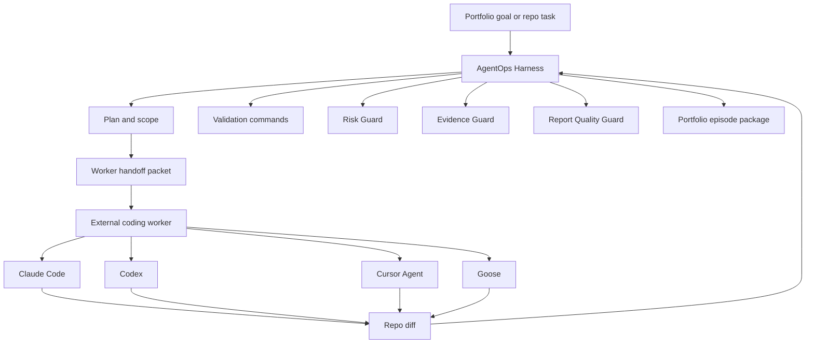
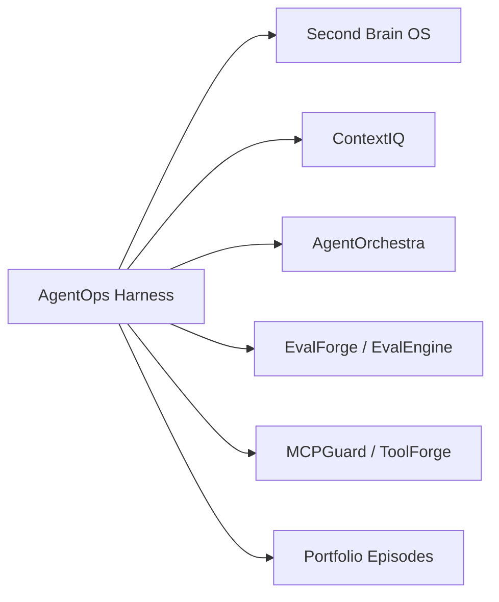
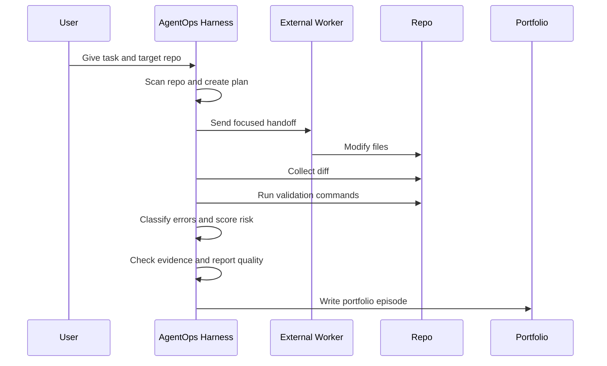

# AgentOps Harness Strategy

AgentOps Harness is the control plane for building and validating the portfolio.
It is not trying to become another coding agent. Claude Code, Codex, Cursor,
Goose, and similar tools are the workers. AgentOps Harness plans, delegates,
checks, measures, and packages the evidence.

This file is durable context for future agents working in this repository.

## Core Thesis

Models are not the moat. The harness around the model is the moat.

A coding agent can generate code, but a serious engineering workflow needs the
surrounding system:

- repo understanding
- task planning
- focused worker handoff
- external worker execution
- diff attribution
- validation commands
- error classification
- risk scoring
- evidence checks
- report quality checks
- portfolio-ready proof packages

AgentOps Harness owns that surrounding system.



## Worker Boundary

AgentOps Harness does not secretly edit code by default.

It should delegate implementation to explicit workers:

| Worker | Role | Harness responsibility |
|---|---|---|
| Claude Code | strong coding and repo implementation | provide focused handoff, validate diff |
| Codex | local coding agent and integration worker | provide task packet, validate output |
| Cursor Agent | IDE-native coding workflow | install integration rules, validate result |
| Goose | local/desktop agent experiments | generate recipe, validate result |
| Other CLI worker | any command that accepts repo + task | run command, attribute diff, score risk |

The worker can be replaced. The harness record must remain stable.

```text
agentops edit
  --repo /path/to/repo
  --task "Implement a narrow portfolio slice"
  --worker-command "<worker CLI command using {repo_path} and {task}>"
```

## Current Pipeline

The current LangGraph pipeline is the right spine:

```text
scan_repo
  -> create_plan
  -> optional_external_worker
  -> collect_diff
  -> run_tests
  -> review_diff
  -> assess_risk
  -> write_report
  -> check_report_quality
  -> check_evidence
  -> persist_run
```

This is the key product shape. Future work should deepen these nodes, not replace
the pipeline with a cosmetic dashboard.

## Portfolio Factory

The portfolio should not be 24 disconnected demos. AgentOps Harness should make
each project measurable.



For each project, the harness should produce an episode:

- what task was attempted
- which repo was used
- which worker mode ran
- what changed
- which commands passed or failed
- what risk score was assigned
- what guardrails found
- why this matters for the portfolio

These episodes become proof, not process noise.

## Source Inspirations

Use outside projects as patterns, not distractions.

| Source | Useful pattern | Decision |
|---|---|---|
| Cursor harness writing | dynamic context, model-specific tool formats, keep rate, error taxonomy | implement the ideas inside AgentOps Harness |
| Anthropic long-running app harness | planner -> generator -> evaluator with real verification | use as the multi-agent execution pattern |
| HKUDS/OpenHarness | tools, skills, hooks, permissions, dry-run discipline | borrow patterns, do not clone |
| HKUDS/OpenSpace | evolving personal skills, task reuse, quality monitoring | maybe later for learned worker profiles |
| tinyhumansai/openhuman | local personal memory and wiki | belongs mostly in Second Brain OS |
| gsd-build/get-shit-done | spec files, milestones, focused tasks | use as workload/episode style inspiration |
| LangChain Deep Agents | planning, filesystem access, subagents, approvals | use for design vocabulary and future execution |

If a new repo appears, classify it this way before building anything:

```text
Does it improve planning?     -> maybe harness plan/handoff feature
Does it improve memory?       -> Second Brain OS
Does it improve execution?    -> external worker integration
Does it improve validation?   -> AgentOps Harness guard/eval feature
Does it only look exciting?   -> document, do not chase
```

## What Makes This Flagship-Grade

The project becomes impressive when it can prove real agent work, not just talk
about it.

Minimum flagship loop:



If this loop works repeatedly across ContextIQ, Second Brain OS, AgentOrchestra,
and other projects, the portfolio story becomes strong:

> I built a local-first agent harness that delegates implementation to coding
> agents, validates their output, records risk and evidence, and turns each
> project into reproducible portfolio proof.

## Near-Term Build Plan

### Phase 1: Real Delegation Loop

Goal: prove that `agentops edit` can delegate to a real worker and package the
result.

Deliverables:

- worker profiles for `codex`, `claude`, `cursor`, and `goose`
- `agentops delegate` or improved `agentops edit --worker <name>` UX
- one real edit episode against a portfolio repo
- workload gates pass
- evidence package generated

### Phase 2: Error Taxonomy

Goal: stop logging vague failures.

Add structured failure categories:

- `InvalidArguments`
- `UnexpectedEnvironment`
- `ProviderError`
- `WorkerTimeout`
- `WorkerBlocked`
- `ValidationFailed`
- `EvidenceMismatch`
- `Unknown`

Every failed run should explain which layer failed.

### Phase 3: Dynamic Context

Goal: connect Second Brain OS and ContextIQ to planning.

Before planning, the harness should fetch relevant project context:

- project spec from `PORTFOLIO.md`
- repo-local docs
- prior portfolio episodes
- Second Brain notes
- active workload manifest

The run record should show what context was used.

### Phase 4: Model And Tool Profiles

Goal: implement the Cursor insight that the same model behaves differently with
different tool formats.

Track:

- worker name
- model/provider if available
- edit strategy: patch, string replacement, file rewrite, unknown
- tool failure count
- validation result
- risk score
- later keep rate

### Phase 5: Keep Rate

Goal: measure whether agent changes survive.

For edit runs, record:

- changed files
- commit or diff hash
- accepted/rejected status
- later modified/reverted status
- survived after N days

This becomes a serious quality metric for the harness.

## Non-Goals

Avoid these until the engine proves itself:

- complex dashboard UI
- broad cloud platform rewrite
- cloning OpenHarness/OpenSpace/OpenHuman
- adding many model providers before validation is strong
- claiming autonomous coding if the harness is only observing

The next impressive thing is not more UI. It is one real delegated edit run with
evidence.

## Instructions For Future Agents

When working in this repo:

1. Read `README.md`, `docs/ARCHITECTURE.md`, and this file first.
2. Preserve the control-plane boundary: external agents implement, AgentOps
   Harness validates.
3. Keep mock/no-key demo paths working.
4. Add tests for every new guard, package, or CLI command.
5. Prefer measurable run artifacts over vague narrative docs.
6. Do not introduce a complex UI before the CLI/engine proves the loop.
7. If a worker claims work, verify it from git diff, command output, and tests.

## Next Concrete Step

Build the first real delegated portfolio run:

```text
AgentOps Harness
  -> choose ContextIQ or Second Brain OS workload
  -> draft handoff
  -> run Codex/Claude/Cursor as external worker
  -> collect diff
  -> run focused tests
  -> classify failures
  -> score risk
  -> package episode
```

This is the next proof point.
